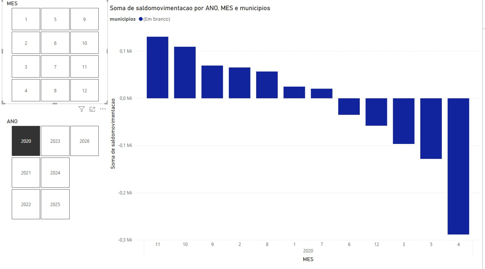

# Aula 10 - Power bi

 usando o powerbi com os Dados abertos sp

trabalho-emprego-formal-municipios do estado de são Paulo

para responder as perguntas que a professora gerou 

1° PERGUNTA 
qual ano e mês o saldo de movimentação foi menor ?

resposta: o ano foi o 2020 e o mês foi abril.

2° PERGUNTA 
qual sexo possui o maior saldo de movimentação em cada ano ? 

resposta: não possui sexo para comparações.

-------------------------------------------
usando o powerbi com os Dados abertos sp

trabalho-emprego-formal-municipios do estado de são Paulo 

criando e respondendo 3 perguntas que foram criadas por nós alunos. 

1° PERGUNTA 
qual ano e mês teve o maior saldo de admissão?

resposta: o ano foi 2025 e o mês foi fevereiro 

