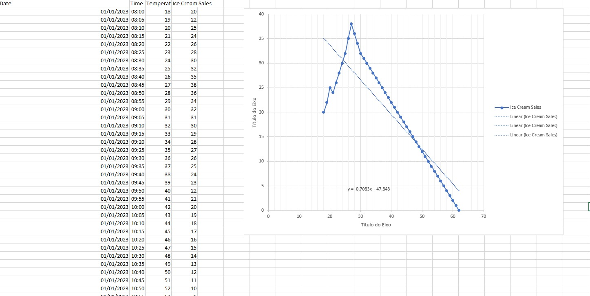

# Aula 11 - Introdução a regressão linear 

Dados kaggles
Data setet/Temperatura and ice cream sales
editamos no "Excel"
para obtermos o Y=0,7083X + 47,843

logo após levamos aos google colap (payton) na biblioteca pandas para obtermos a regressão linear e o coeficiente -0,67

.jpg)
