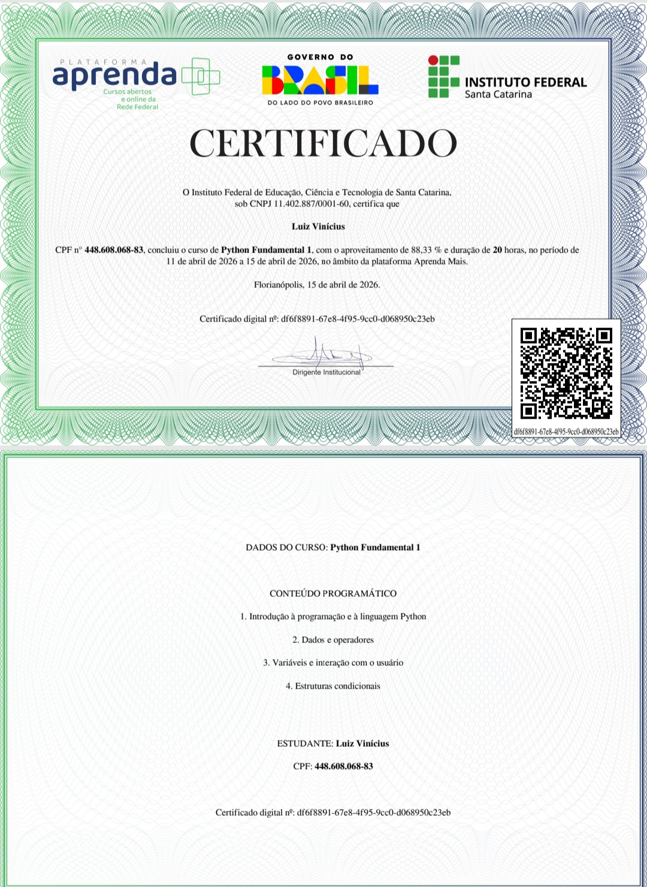

# Curso Python Fundamental - 01

# Sobre o curso
Curso fundamental Python com foco nos fundamentos da programação e no desenvolvimento da lógica computacional

# Módulo - 01 Introdução à Programação e à Linguagem Python

Linguagem Python
Apresentação dos conceitos iniciais de programação e introdução à linguagem Python, com foco na compreensão da estrutura básica de um programa.

Ao final do módulo, foram realizados testes práticos utilizando a função print para exibição de informações.

* |certificado Python Fundamental 01

